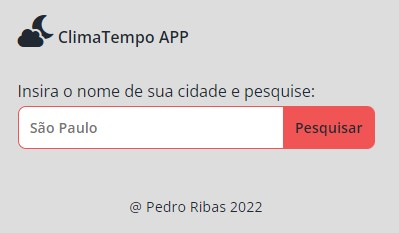
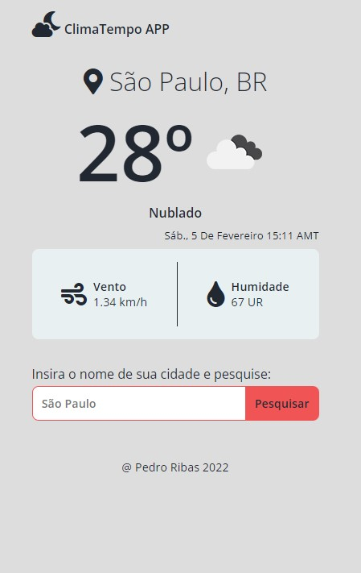
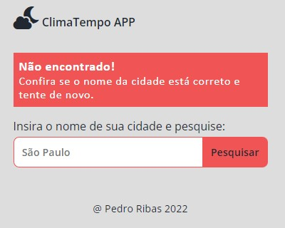

**Aviso:** Este README está **em construção.**

<!-- Title & Description -->
<h1 align="center">ClimaTempo APP</h1>
<p align="center">Aplicativo para acessar informações meteorológicas.</p>

<!-- Badges -->
<p align="center">
  
  
  
  
  
  <a href="https://floating-plateau-59695.herokuapp.com/">
    
  </a>
  
</p>

<!-- Tabela de conteúdos -->
<p align="center">
  <a href="#objetivo">Objetivo</a> &#xa0; | &#xa0;
  <a href="#aviso">Aviso</a> &#xa0; | &#xa0;
  <a href="#screenshots">Screenshots</a> &#xa0; | &#xa0;
  <a href="#pré-requisitos">Pré-requisitos</a> &#xa0; | &#xa0;
  <a href="#rodando-o-servidor">Rodando o Servidor</a> &#xa0; | &#xa0;
  <a href="#tecnologias-utilizadas">Tecnologias</a> &#xa0; | &#xa0;
  <a href="#contribuidores">Contribuidores</a> &#xa0; | &#xa0;
  <a href="#autor">Autor</a> &#xa0; | &#xa0;
  <a href="#licença">Licença</a>
</p>

<br>

## Objetivo

Este é um aplicativo de clima-tempo em língua pt-BR.  

Nele, o usuário busca pelo nome de uma cidade e o app gera informações meteriológicas sobre a localidade, como temperatura, descrição do tempo, velocidade do vento e humidade.

O meu objetivo foi praticar o framework Express e o consumo de API de terceiros no backend. Portanto, o app tem fins educacionais e não tem a intenção imediata de explorar todas as funcionalidades de um app profissional do gênero.

Em suma, o servidor recebe o nome da cidade buscado pelo usuário no formulário, passa-o como `query` da URL da requisição HTTP, e os dados obtidos são renderizados com código HTML/JS pelos arquivos EJS.

## Aviso

- **A chave-API que eu usei no deploy foi removida do arquivo `app.js` deste repositório público por motivos de segurança.**

## Screenshots

- Tela inicial


- Resultado normal da pesquisa


- Mensagem de erro caso o usuário erre o nome da cidade


<!--
## :rocket: Technologies

The following tools were used in this project:

- [NodeJS](https://nodejs.org/en/)
- [Express](https://expressjs.com/)
- [EJS](https://ejs.co/)
- [OpenWeather's API](https://openweathermap.org/)

## :white_check_mark: Requirements

Before starting, you need to have [Git](https://git-scm.com) and [Node](https://nodejs.org/en/) installed.

## :checkered_flag: Starting

```bash
# Clone this project
$ git clone https://github.com/pedroibribas/weather-app

# Access project directory
$ cd weather-app

# Install dependencies
$ npm install .

# Run the project
$ node app.js

# The server will initialize in the <http://localhost:3000>
```

## :memo: License

This project is under license from [MIT](LICENSE.md).

Made with :heart: by <a href="https://github.com/pedroibribas" target="_blank">Pedro Ribas</a>

&#xa0;
-->

<a href="#top">Voltar ao topo</a>
